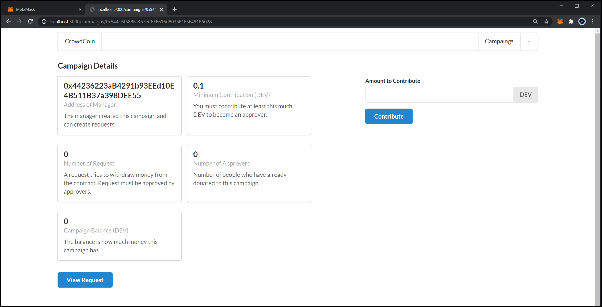
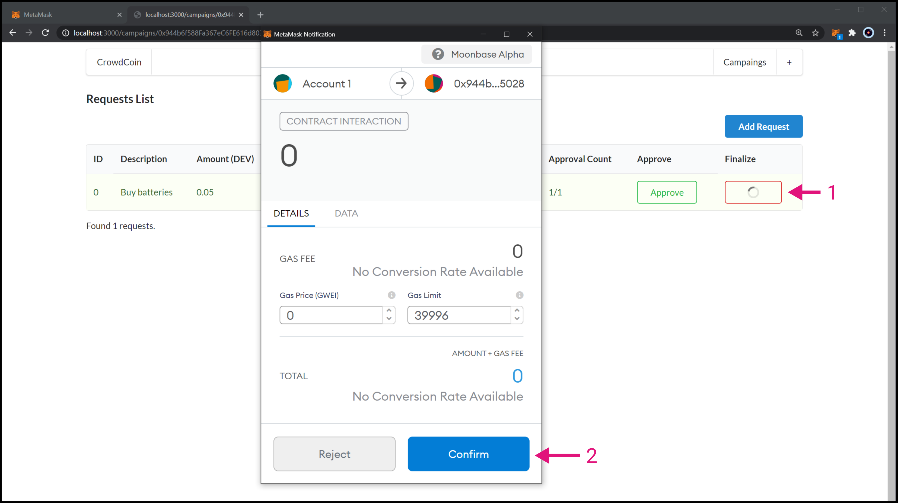

# 

# CrowdCoin Example on Moonbeam

This is a dApp example to deploy on Moonbeam, in this case, we will do so on the Moonbase Alpha TestNet. CrowdCoin is a platform where people can crowdfund their projects (called campaigns) in a trustless ways. Project owners are able to make payment requests to their contributors, which have the power of approving them and have more control over the resources they've contributed to a project.

In order to interact with Moonbase Alpha, you need to have the web browser wallet extension [MetaMask](https://metamask.io/) installed. In addition, the following URLs provide useful information to get started with the TestNet:

 - [The Moonbase Alpha TestNet](https://docs.moonbeam.network/networks/testnet/)
 - [Connect MetaMask to Moonbase Alpha](https://docs.moonbeam.network/getting-started/testnet/metamask/)
 - [Get TestNet tokens from the faucet](https://docs.moonbeam.network/getting-started/testnet/faucet/)

More information can be found in our [documentation site](https://docs.moonbeam.network/). This guide is comprised of the following sections:

 - [File structure of the project](#files-structure)
 - [Contract deployment](#contract-deployment)
 - [Integration with Moonbeam](#integration-with-moonbeam)
 - [Testing the Web App](#testing-the-web-app)
 - [Contact us](#contact-us)

This example was adapted from [Stephen Grider's course](https://www.udemy.com/course/ethereum-and-solidity-the-complete-developers-guide/), and uses [Next.js](https://nextjs.org/). At the time of writing, Node.js and NPM versions used were v15.3.0 and 7.0.14, respectively.

## Files Structure

This repository consists of different folders and files that are required to build the whole project. Let's drill down into the main file-structure:

 - Components: folder with the reusable components for the Web app
 - Ethereum: folder with all the files related to the deployment on the Moonbase Alpha TestNet
 - Pages: where the files Web app pages are located 
 - Test: where all tests related to our contract are. In this example, there is only one file with some tests performed
 - Routes.js: a file that export helpers that handle dynamic custom routes inside our Web app. For example a route for a campaign that contains a specific address
 - Server.js: a file that boots up the Next.js application, and tells it to use the `routes.js` file

## Contract Deployment

In this section, we'll discuss the contract and the files for its compilation and deployment to the Moonbase Alpha TestNet. First, let's look over the file-structure inside the `ethereum` folder, where all the ethereum-related code resides:

 - Campaign.js: creates a local instance of the campaign contract, to be used by the Web app
 - Compile.js: handles the compilation of the contract. Exports a `.json` that contains the bytecode and ABI for each of the contracts compiled
 - Deploy.js: deploys the factory contract to Moonbase Alpha, returns the address which is necessary for the `factory.js` file
 - Factory.js: creates a local instance of the campaign factory contract, to be used by the Web app. It needs the address of the deployed factory contract
 - Web3.js: web3 instance to be used by the different files of our project

### The Contract File

The contract file, named `CrowdCoin.sol`, actually contains two different sets of smart contracts: campaign factory, and campaign. The reason behind this structure is simple: the owner of the CrowdCoin platform only pays for the gas when deploying the factory contract, while the campaign owners need to cover the deployment costs of each campaign. 

The campaign factory contract holds the list of the campaigns deployed and provides a function so that any user can create a new campaign. This functions calls the campaign contract, and only needs the minimum contribution as input.

Each campaign is deployed as an instance of the campaign contract and has a particular address. The contract holds the three functions available to interact with a campaign:

 - Contribute: function to contribute to the project. If the contribution is above a certain minimum, the contributor is whitelisted to vote on requests
 - CreateRequest: function that handles the creation of a request in a campaign. A request is a petition, from the campaign owner to the contributors, to approve a payment to a specific address. Each request is stored in a mapping by an ID
 - ApproveRequest: function used by contributors to approve the request, of a given ID, generated by the campaign owner
 - FinalizeRequest: function used by the campaign owner to finalize a request and execute the payment. The request needs to have at least a 50% approval rate among contributors
 - GetSummary: a view function to visualize details of the campaign. It returns the minimum contribution, its address, number of requests, number of contributors and the address of its owner
 - GetRequestCount: a view function that returns the number of requests the campaign has

The whole contract can be found [here](./ethereum/contracts/CrowdCoin.sol)

### Compiling the Contracts

To compile the contract, we need to run the `compile.js` file with node:

```
node compile.js
```

If compilation was successful, a file for each contract is created inside a folder named `build`. This files contained all the compilation information, but more importangly, they have the bytecode and ABI of our contracts.

```
moonbeam-crowdcoin
|--components/
|--ethereum/
|  |--build
|  |  |--Campaign.json
|  |  |--CampaignFactory.json
|  |--campaign.js
|  |--compile.js
|  |--deploy.js
|  |--factory.js
|  |--web3.js
|--pages/
|--test/
|--routes.js
|--server.js
```

### Deploying the Contracts

To deploy the contracts, we need to run the `deploy.js` file with node. But first, the file is configured so that you have the private key stored in an environment variable as `PRIV_KEY`. You can do so by running the following code: 

```
export PRIV_KEY="your-private-key-here"
```

Now you have your private key available to use at `process.env.PRIV_KEY`. Let's run the deploy file:

```
node deploy.js
```

After the contract is deployed, its address is shown in the terminal:


**Note:** The address of the contract needs to be entered on the `factory.js` file. Remember that this address is the campaign factory and that we will use it to create new campaigns. However, each campaign will have a separated address as it will be its own contract deployment.

## Integration with Moonbeam

But you might ask yourself: where is Moonbeam in all this? Moonbeam's focus is to create a fully Ethereum-compatible environment on Polkadot. Therefore, no special requirement is needed, and adapting this project to deploy on Moonbase Alpha is quite simple.

On one hand, you might have noticed that in the `deploy.js` file, we pass in the TestNet HTTPS endpoint when creating the web3 instance. 

On the other hand, the `web3.js` file provides the web3 provider for two different situations:

 - When a user is visiting the website in the browser and has MetaMask installed, the web3 instance used will be that injected by MetaMask, which can be configured to [connect to Moonbase Alpha](https://docs.moonbeam.network/getting-started/testnet/metamask/)
 - On the contrary, an HTTP provider is set to use the TestNet HTTP endpoint, for the server (rendering the site) or for users without MetaMask can also visit the website, although they won't be able to interact with the contracts

Remember that for this example to work, we need to enter the address of the deployed campaign factory in the `factory.js` file.

## Testing the Web App

In this section, we'll briefly discuss the Web App structure as we do a test drive of our CrowdCoin platform. 

### Start the Web App

To start the application, run the following command on the main directory:

```
npm run dev
```

This not only builds the project but starts the server-side rendering of each action the user takes. If everything builds without errors, the site should be available on `http://localhost:3000/`:


Once we open the Web App, a MetaMask pop-up will ask you if you want to allow the connection to the site:


### Create a New Campaign

The Web App is quite simple. In the main screen, the deployed campaigns are shown. From here, users can also create their own campaigns by clicking on the "Create Campaign" box, or the "+" symbol on the top right corner:


This opens a new site, where the user is prompted for the minimum contribution to join the campaign (as an approver). In our example, we'll go for `0.1 DEV` (which translates to `100000000000000000` in WEI). Once we click the "Create" button, MetaMask should pop-up displaying details of the transaction and asking for confirmation.


Behind the scenes, the site is sending a transaction with the `createCampaign` method of the campaign factory contract. Inside the `./pages/campaigns/new.js` you will find the following lines:

```
const accounts = await web3.eth.getAccounts();
         await factory.methods
            .createCampaign(this.state.minimumContribution)
            .send({ from: accounts[0] });
```

Where the factory instance is obtained from the `factory.js` file we mentioned earlier. Now that the campaign is deployed, it should be listed as well on the main page. This information is returned by calling the `getDeployedCampaigns()` method of the campaign factory contract. 


By clicking on "View Campaign", we can see the campaign details, which are obtained by calling the `getSummary()` method of the campaign contract.



### Create a New Request

Now, let's create a request to spend some of the campaign balance by leveraging the `createRequest()` method from our campaign contract. To do so, click on the "View Request" and then on "Add Request". In here, we need to fill up the information necessary to create the request structure we described on the contract file. In this example, we want to buy the batteries for our product. The recipient was set to another account created in MetaMask so we can verify that the funds arrived after the request is finalized. Next, click on the "Create" button and a MetaMask pop-up should appear. In here, we need to modify the gas limit to `200000`. 


Currently, we are experiencing some gas estimation issues only for specific functions, this is already being worked on. More information can be found [here](https://github.com/paritytech/frontier/issues/198). 

Once the request is created, it will be displayed on the request list. Here, contributors can vote on them, and the campaign owner can trigger the finalization of a requests once the approval rate is more than 50%.


### Contribute, Approve and Finalize Requests

Next, let's contribute to our campaign with a different account (in our case the same account of the recipient of the battery payment). To do so, in the campaign details site, set the amount to contribute (`0.1 DEV` in our example), click on "Contribute" button, and confirm the transaction in MetaMask. This action uses the `contribute()` method of our campaign contract.


Once the transaction is processed, the details of the campaign are updated with the new balance and number of approvers. With the same account, lets head into the request list and approve the "Buy batteries" request by clicking on the button and confirming the transaction on MetaMask. This action uses the `approveRequest()` method of our campaign contract.


Once the transaction is processed, the approval count is updated, and the owner on the campaign can finalize the request. To do so, head back to the account which owns the campaign, click on the "Finalize" button, and confirm the transaction on MetaMask. And lastly, this action uses the `finalizeRequest()` method of our campaign contract.



Once the transaction is processed, the recipient address should receive the amount set in the request. This request is now finalized and it will be grayed-out on the list.

### Final Remarks

This example, although simple, provides a great insight on how you can get started with Moonbeam. If you are familiar with the Ethereum ecosystem, building on Moonbeam will feel very similar.

Feel free to visit our [documentation site](https://docs.moonbeam.network/), where you will find lots of guides to get you started. As of the writing of this documet, the following tools have been tested:
 - [MetaMask](https://docs.moonbeam.network/integrations/metamask/)
 - [Remix IDE](https://docs.moonbeam.network/integrations/remix/)
 - [Truffle](https://docs.moonbeam.network/integrations/trufflebox/)
 - [Ethers.js library](https://docs.moonbeam.network/integrations/jslibraries/etherjs/)
 - [Web3.js library](https://docs.moonbeam.network/integrations/jslibraries/web3js/)
 - [Subscription to events](https://docs.moonbeam.network/integrations/pubsub/)

## Contact Us

If you have any feedback regarding the integration of a dApp into Moonbeam, or any other Moonbeam related topic, feel free to reach out through our official development [Discord server](https://discord.gg/PfpUATX).
